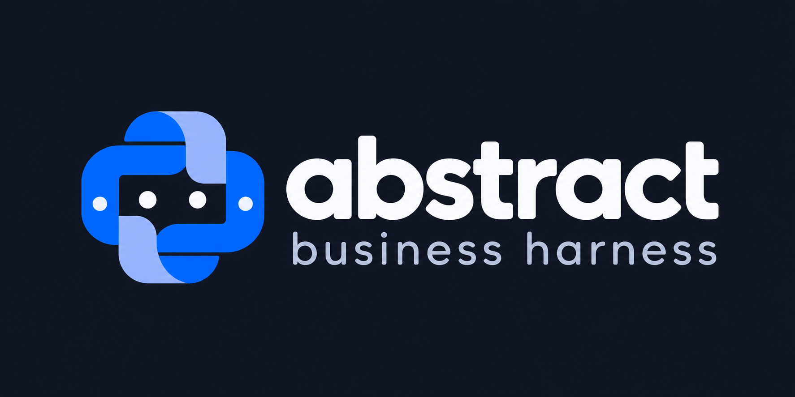

# bizharness



A long-horizon **analysis agent engine**. Domain logic — tools, skills,
instructions, credentials — lives in a **profile directory** you pass at
runtime. This repository has no customer data and is meant to be public.

It was first built for a large agro commodity producer: multi-hour analyses
against an internal planning system, delivered as HTML reports. The engine
is the reusable half of that design. How to write a profile like that one
(lessons included, no confidential names or figures) is in
[docs/authoring-profiles.md](docs/authoring-profiles.md).

This is usable for real work, and it is still experimental. Run it on a
machine you control. A host that can reach customer data, production
systems, or other material you cannot afford to expose is the wrong place
for it. The API key is a basic gate, not a reason to put the process
somewhere sensitive.

A profile tool runs with the same privileges as the engine. Do not add one
that reads or writes data until you have worked through what it can reach,
what it can change, and what a wrong or hostile call would do.

```bash
uv sync
uv run bizharness serve --profile profiles/example --port 8811
# other terminal
cd ui && npm install && VITE_API_URL=http://localhost:8811 npm run dev
```

Open the Vite URL (5173, or 5174+ if that port is taken). The UI proxies
`/agui`, `/profile`, and the other engine routes to `VITE_API_URL`, so a
second Vite on another localhost port does not need CORS. The example
profile talks to a public JSON API and uses `openai:gpt-5.6-luna` (needs
`OPENAI_API_KEY`). Set `OPENAI_BASE_URL` to send that client to an
OpenAI-compatible server such as OpenRouter
(`https://openrouter.ai/api/v1`); leave it unset to use OpenAI. For a
no-key smoke test, set `[model] spec = "test"`.

A production build of the UI is served by the same process. `npm run build`
in `ui/` (with `VITE_API_URL` empty) writes `ui/dist`, and `bizharness serve`
then returns that app at `/`. Set `HARNESS_UI_DIR` to point somewhere else.

## Docker

The image contains the engine and that UI build. The profile and its state
stay on the host:

```bash
docker build -t bizharness .
docker run --rm -p 8811:8811 \
  -e OPENAI_API_KEY \
  -e HARNESS_ADMIN_TOKEN \
  -v "$HOME/eia-profile:/harness-profile" \
  bizharness
```

Pushes to `main` publish `dkatz23238/abstract-business-harness` as `latest`,
`main`, and `sha-<short commit>`. Pin a deploy to the `sha-` tag. `latest`
and `main` move with the branch.

Open `http://localhost:8811`. The image reads one mount, `/harness-profile`.
A `profile.toml` there is the profile; otherwise `profile/profile.toml` is.
State goes to `harness-data/` when that directory exists, otherwise `data/`.
An env value that is an absolute path to a missing file is reread from the
same filename in the mount, so host paths stored in `profile.toml` still
find the databases next to the profile. `LOGFIRE_TOKEN` is optional.
`HARNESS_UI_TOKEN`, when set, is only the initial API key if
`<data-root>/api_key` does not exist yet. The mount has to be writable by
uid 1000.

## Layout

```
bizharness/          engine package (CLI: bizharness)
profiles/example/    public demo profile
docs/                authoring guide
ui/                  AG-UI frontend; strings come from GET /profile
data/                gitignored per-profile state
```

A real customer profile is a **separate private git repo**. Point
`--profile` at it and `--data-root` at its `data/` so threads stay next to
the profile, not in this checkout.

## Profile in one page

```
profile.toml          model, code tool name, skills, tool modules, env, limits
instructions.md       domain prompt; may embed {{ core.* }} engine blocks
memory_guidance.md     optional
skills/<name>/SKILL.md
tools/*.py            each may expose register(ctx) -> FunctionToolset
ui.json               title, placeholder, data_calls_label, data_source_name
```

Environment declared in `[env]` resolves as:

1. `<PROFILE_ID>_<NAME>` in the process environment
2. bare `<NAME>` in the process environment
3. `<data-root>/<id>/secrets.env` (0600, gitignored)
4. `[env.defaults]` in profile.toml

`bizharness profile validate --profile PATH` prints a report and fails on
missing required env or a broken tool module.

## CLI

```
bizharness serve --profile PATH [--port 8811]
bizharness chat --profile PATH [-p prompt] [-v]
bizharness profile validate --profile PATH
bizharness profile env-list --profile PATH
bizharness profile env-set NAME VALUE --profile PATH
bizharness history --profile PATH [session]
bizharness profile new DIR [--from PATH]
```

## API key

Every API route except `/admin/*`, `/docs`, and the built UI files requires
the API key: `Authorization: Bearer <key>`, or `?token=<key>` when the
client cannot set a header (the tool-event stream and report iframes).

The first startup writes `<data-root>/api_key` (mode 0600) and prints the
value. If `HARNESS_UI_TOKEN` is set and the file is missing, that value is
what gets stored. After the file exists it is the source of truth: changing
`HARNESS_UI_TOKEN` does not replace it. Delete the file before restart to
seed a new one from the env var.

The web UI asks for this key on the sign-in screen and keeps it in
`localStorage`. The same key is what external API clients send.

`POST /admin/api-key` (admin token) replaces the key immediately. The Admin
tab has a **Rotate API key** button that does this and shows the new value
once. Other browsers signed in with the old key are signed out.

## Admin

Admin HTTP (Bearer `HARNESS_ADMIN_TOKEN`): rewrite tools/skills/instructions,
set env values, reload, rotate the API key. Writes are validated before they
land; previous files go to `_history/` under the profile. **Tools are
trusted code** — same privileges as the engine process. Do not expose the
admin token.

The web UI has an **Admin** tab that talks to those endpoints. Unlock with
the admin token (stored in this tab’s session storage, not in the Vite
build). Unset `HARNESS_ADMIN_TOKEN` and `/admin` stays 404. `/admin` is
not gated by the API key — the two credentials are independent.

## License

MIT. See [LICENSE](LICENSE).
